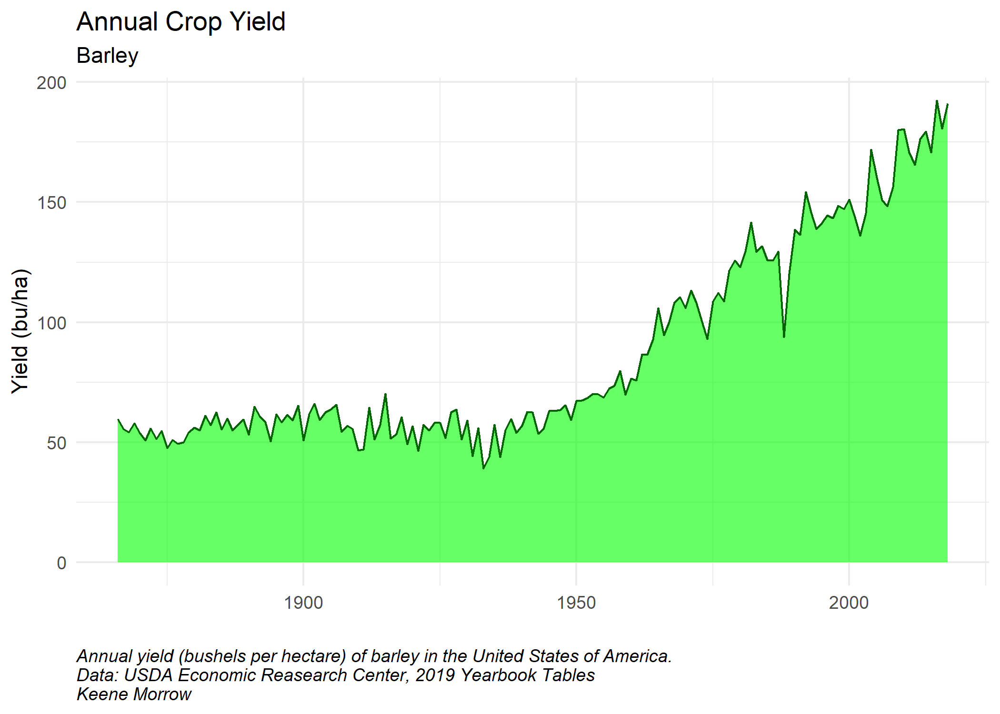
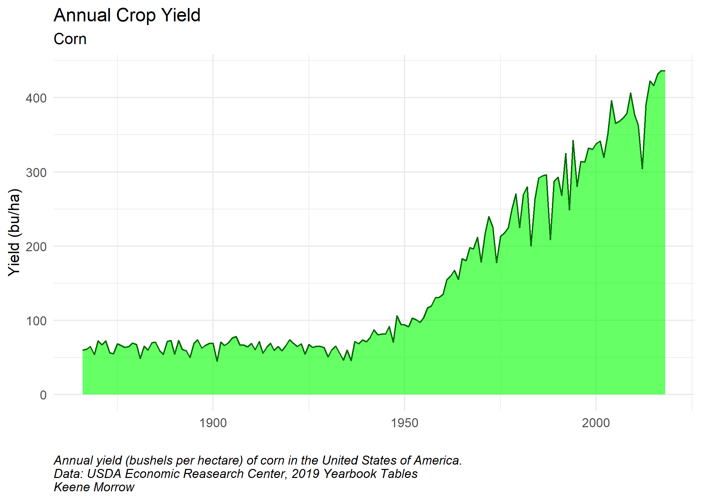
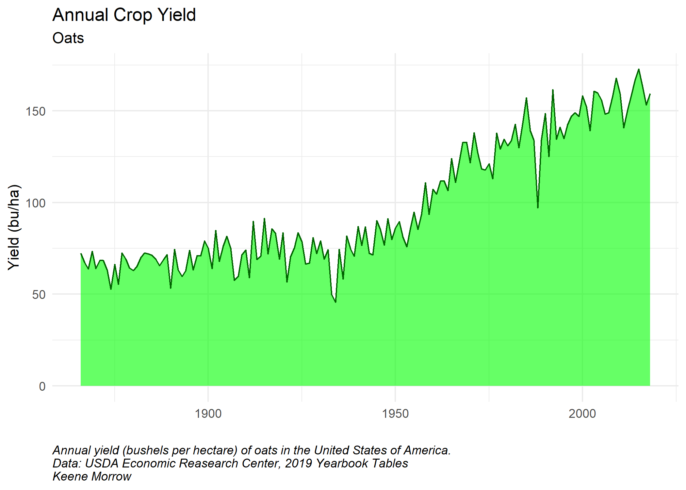
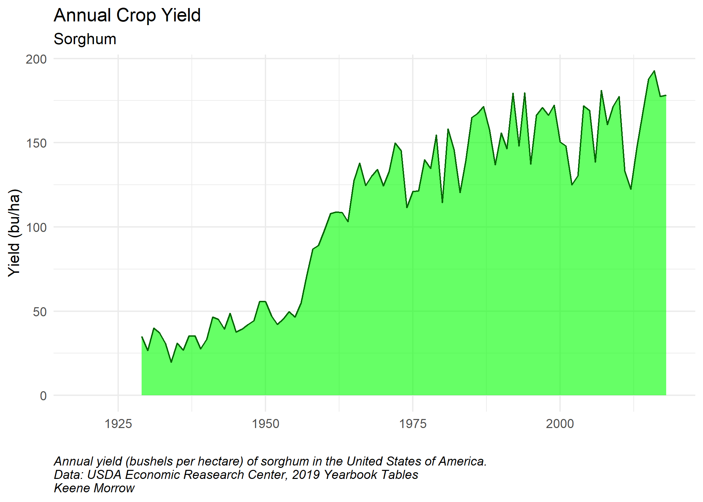

```{r setup, include=FALSE}
knitr::opts_chunk$set(echo = TRUE)

library(tidyverse)
library(here)
library(stringr)
library(lubridate)

# Read in Data
grain <- read_csv(here::here("data", "grain_2020.csv"))


fert <-  read_csv(here::here("data", "fertilizer_2020.csv")) %>%
  mutate(fertilizer = str_to_sentence(fertilizer))
  # mutate(year = lubridate::as_date(year)) %>%
  # mutate(year = lubridate::year(year))

```
### Background

In lecture and readings, we’ve discussed how crop yield can change over time, and how fertilizer use contributes to such trends. In this assignment, you will be working with two agricultural datasets from the United States Department of Agriculture. The first dataset (`grain_2020.csv`) contains data from the mid 1800s to present day on national production of corn, sorghum, barley, and oats:
The available columns are:

- `hectares_planted`: in million hectares
- `hectares_harvested`: in million hectares
- `production`: in million bushels (sorry about the units, the USDA won’t switch to using actual units)
- `yield`: in bushels per hectare

Data from the USDA’s Economic Research Service, 2019 Yearbook Tables.

The second dataset (`fertilizer_2020.csv`) contains information on fertilizer use for soybeans, corn, and wheat from 1964 to 2016. The key variable in this dataset is `kgh`, which means kilograms per hectare. These data are originally from the USDA’s Economic Research Service, 2019 Fertilizer Use, but I have modified it to use kilograms per hectares instead of pounds per acre.

### Patterns in yield over time

In `grains_2020.csv`, there is a column for yield. As shown in Grassini et al. 2013, there are six possible statistical models to describe crop yield trends over time (Figure 3 in the paper shows: linear, quadratic plateau, linear piecewise, linear upper plateau, linear lower plateau, and exponential).

##### a. Create a finalized plot (including title and caption) of yield vs. time for each of the grains in the dataset. (5 points)

```{r}
crop_g <- unique(grain$commodity)

for(i in seq_along(crop_g)){
  ggplot(data = subset(grain, grain$commodity == crop_g[i])) +
    geom_area(aes(x = year,
                  y = yield),
              fill = "green", alpha = "0.6") +
    geom_line(aes(x = year,
                  y = yield),
              color = "dark green") +
    labs(y = "Yield (bu/ha)",
         x = "",
         title = "Annual Crop Yield",
         subtitle = crop_g[i],
         caption = paste("Annual yield (bushels per hectare) of ", str_to_lower(crop_g[i]), " in the United States of America.\nData: USDA Economic Reasearch Center, 2019 Yearbook Tables\nKeene Morrow", sep = "")) + 
    theme_minimal() +
    theme(plot.caption = element_text(hjust = 0, face = "italic"))
  
  ggsave(here::here("figures", paste(crop_g[i], "_yield.png", sep = "")),
         height = 5, width = 7)
}
```









##### b. Which statistical model describes the trend you see for each crop? Justify your choice with the shape of the line you observe. (5 points)


##### c. Extra Choose a crop you like, and fit the statistical model you think it follows. Show your results as a regression table (geom_smooth is not a way to fit a model) (2.5 points)

### Fertilizer use

##### a. Create a finalized plot (including title and caption) of fertilizer use through time, for each of the crops in the dataset. (5 points)

```{r}
crop_f <- unique(fert$crop)

# for(i in seq_along(crop_f)){
#   ggplot(data = subset(fert, fert$crop == crop_f[i])) +
#     geom_area(aes(x = year,
#                   y = kg_h),
#               fill = "red", alpha = "0.6") +
#     geom_line(aes(x = year,
#                   y = kg_h),
#               color = "dark red") +
#     labs(y = "Fertilizer Use (kg/ha)",
#          x = "",
#          title = "Annual Fertilizer Use",
#          subtitle = crop_f[i],
#          caption = paste("Annual fertilizer use (kilograms per hectare) of ", str_to_lower(crop_f[i]), " in the United States of America.\nData: USDA Economic Reasearch Center, 2019 Fertilizer Use\nKeene Morrow", sep = "")) + 
#     theme_minimal() +
#     theme(plot.caption = element_text(hjust = 0, face = "italic"))
#   
#   ggsave(here::here("figures", paste(crop_f[i], "_fert.png", sep = "")),
#          height = 5, width = 7)
# }


ggplot(data = subset(fert, fert$crop == "Wheat")) +
    geom_line(aes(x = year,
                  y = kg_h,
                  color = fertilizer),
              size = 1,
              show.legend = FALSE) +
    labs(y = "Fertilizer Use (kg/ha)",
         x = "",
         title = "Annual Fertilizer Use",
         subtitle = "Wheat",
         caption = paste("Annual fertilizer use (kilograms per hectare), by nurtient, for production of ", str_to_lower("Wheat"), " in the United States of America.\nData: USDA Economic Reasearch Center, 2019 Fertilizer Use\nKeene Morrow", sep = "")) +
  scale_x_continuous(expand = c(0, 0)) +
  geom_text(data = subset(fert, fert$crop == "Wheat") %>% filter(year == 2000),
            aes(label = fertilizer,
                x = 2005,
                y = kg_h + 10,
                color = fertilizer),
                hjust = 0,
              show.legend = FALSE) +
    theme_minimal() +
    theme(plot.caption = element_text(hjust = 0, face = "italic"))
```


```{r}
ggplot(data = subset(fert, fert$crop == "Soybeans")) +
    geom_line(aes(x = year,
                  y = kg_h,
                  color = fertilizer),
              size = 1,
              show.legend = FALSE) +
    labs(y = "Fertilizer Use (kg/ha)",
         x = "",
         title = "Annual Fertilizer Use",
         subtitle = "Soybeans",
         caption = paste("Annual fertilizer use (kilograms per hectare), by nurtient, for production of ", str_to_lower("Soybeans"), " in the United States of America.\nData: USDA Economic Reasearch Center, 2019 Fertilizer Use\nKeene Morrow", sep = "")) +
  scale_x_continuous(expand = c(0, 0)) +
  geom_text(data = subset(fert, fert$crop == "Soybeans") %>% filter(year == 2000),
            aes(label = fertilizer,
                x = 2003,
                y = kg_h + 10,
                color = fertilizer),
                hjust = 0,
              show.legend = FALSE) +
    theme_minimal() +
    theme(plot.caption = element_text(hjust = 0, face = "italic"))
```


```{r}
ggplot(data = subset(fert, fert$crop == "Corn")) +
    geom_line(aes(x = year,
                  y = kg_h,
                  color = fertilizer),
              size = 1,
              show.legend = FALSE) +
    labs(y = "Fertilizer Use (kg/ha)",
         x = "",
         title = "Annual Fertilizer Use",
         subtitle = "Corn",
         caption = paste("Annual fertilizer use (kilograms per hectare), by nurtient, for production of ", str_to_lower("Corn"), " in the United States of America.\nData: USDA Economic Reasearch Center, 2019 Fertilizer Use\nKeene Morrow", sep = "")) +
  scale_x_continuous(expand = c(0, 0)) +
  geom_text(data = subset(fert, fert$crop == "Corn") %>% filter(year == 2000),
            aes(label = fertilizer,
                x = 2004,
                y = kg_h + 5,
                color = fertilizer),
                hjust = 0,
              show.legend = FALSE) +
    theme_minimal() +
    theme(plot.caption = element_text(hjust = 0, face = "italic"))

```

##### b. Describe differences in fertilizer use for each crop. What does this suggest about limiting nutrients for each crop? (5 points)


### Case study: corn yield and fertilizer use

##### a. For corn, create a finalized plot (including title and caption) of yield vs fertilizer use, separated by the type of fertilizer. (5 points)

```{r}

corn_g <- grain %>%
  filter(commodity == "Corn")

corn_f <- fert %>%
  filter(crop == "Corn") %>%
  pivot_wider(names_from = fertilizer, values_from = kg_h)
  
corn <- inner_join(corn_g, corn_f) %>%
  select(-crop, -commodity)
  
```


##### b. Explain the relationship between yield and fertilizer you see in the data. Is there a positive linear relationship between fertilizer use and yield? (Hint: recall similar plots presented in lecture) (5 points)

##### c. Extra What explains corn yield? Fit a multiple linear regression with corn yield as the outcome variable, and any relevant explanatory variables. Make sure to transform any relevant variables into units that produce meaningful coefficients. (2.5 points)
